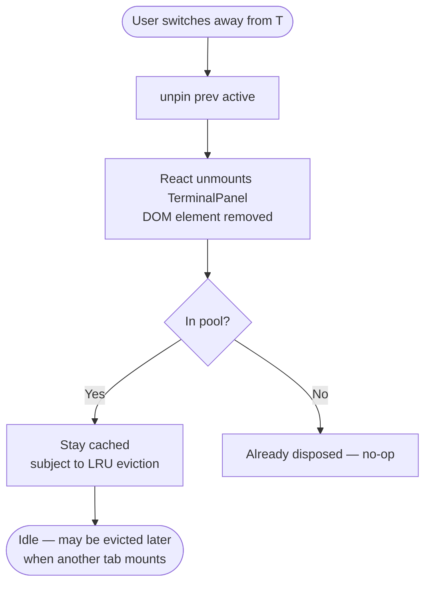
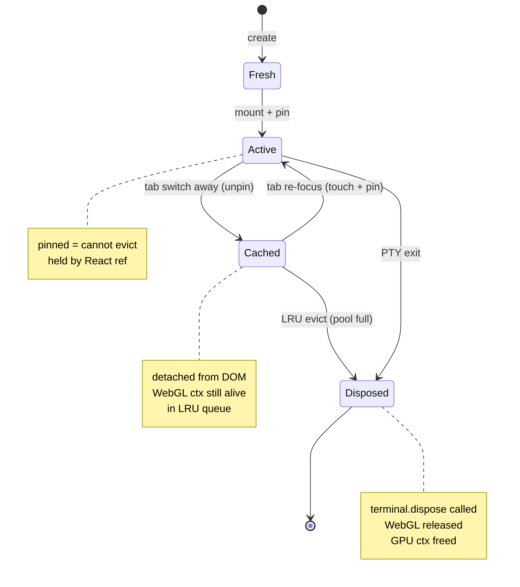
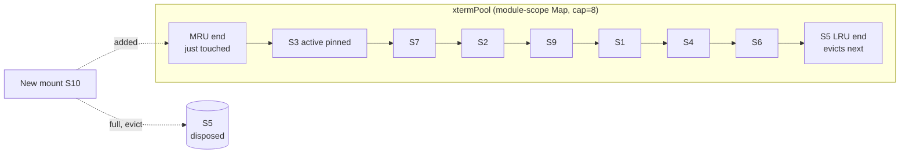

# xterm LRU pool — flow

## Tab-switch → terminal mount

```mermaid
flowchart TD
    Start([User switches to tab T]) --> Mount[React mounts TerminalPanel for sessionId S]
    Mount --> Check{Pool has S?}

    Check -- Hit --> Touch[pool.touch(S)<br/>move to MRU end]
    Touch --> Attach[Re-attach cached<br/>xterm element to DOM]
    Attach --> Pin[pin(S) — mark as active<br/>cannot evict]
    Pin --> Ready([Terminal visible<br/>0 flicker])

    Check -- Miss --> Evict{Pool full?<br/>size >= MAX}
    Evict -- Yes --> DisposeLRU[Find LRU unpinned entry L<br/>L.terminal.dispose<br/>releases WebGL ctx<br/>pool.delete L]
    DisposeLRU --> Create
    Evict -- No --> Create[Create fresh xterm<br/>+ WebglAddon<br/>+ FitAddon<br/>+ SerializeAddon]

    Create --> Rehydrate[window.api.pty.getBuffer S<br/>returns scrollback from main]
    Rehydrate --> Write[terminal.write scrollback]
    Write --> PoolAdd[pool.set S, instance<br/>touched = now]
    PoolAdd --> Pin
```

## Tab-switch away



## Eviction state



## Pool data structure



## Invariants

- **Pinned set** ⊆ **Pool** — active tab always in pool
- **Pool size** ≤ MAX (default 8)
- **Eviction skips pinned** — active sessions never evicted; if all pinned and full, new mount creates un-pooled orphan that disposes on unmount (rare — only with 8+ split panes visible simultaneously)
- **Touch triggers:** mount, PTY data write (keeps hot bg streams warm), serialize addon read
- **Dispose triggers:** LRU evict, PTY exit, mode change, app quit

## Why this works

- Cap on WebGL contexts ⇒ bounded GPU memory
- Pinned active ⇒ never evict what user sees ⇒ no surprise blanks
- Touch-on-write ⇒ noisy background processes stay warm
- Rehydrate cost only on deep-past re-open ⇒ rare, ~100 ms, acceptable
- Module-scope ⇒ survives React unmount ⇒ virtualized tabs work seamlessly
- Explicit dispose ⇒ predictable GPU reclaim (vs GC)
